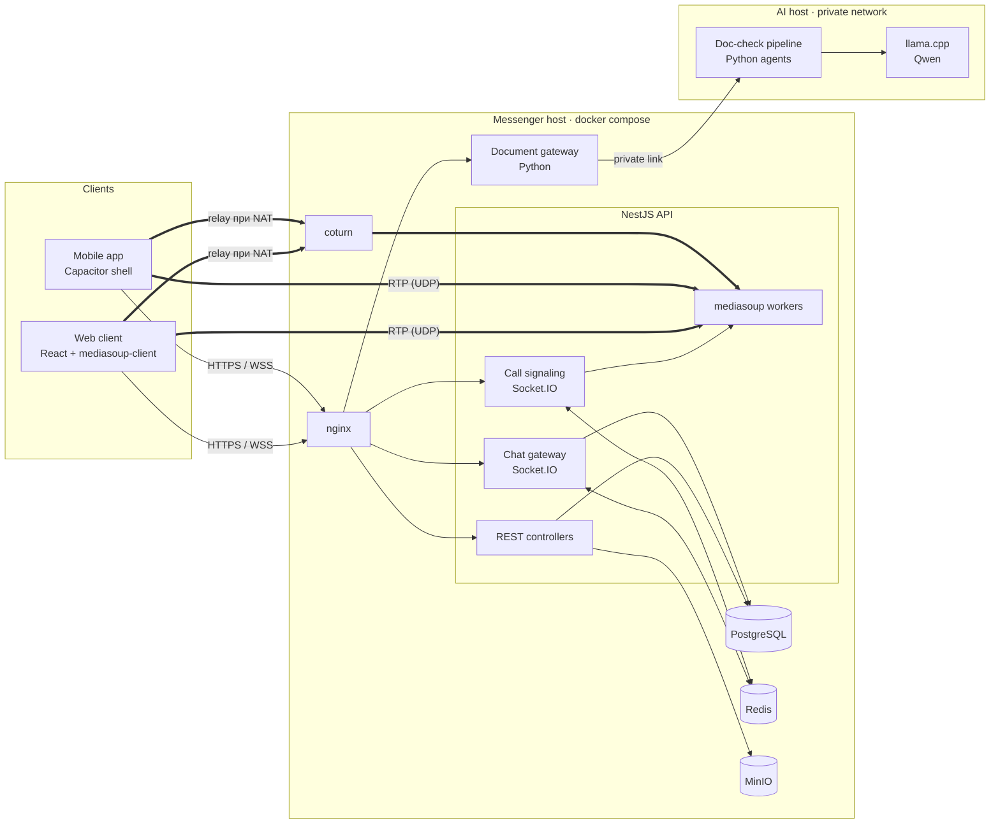

# RM Messenger — корпоративный мессенджер on-prem

Self-hosted мессенджер для компаний, которые держат переписку на своих серверах: чаты, файлы, аудио- и видеозвонки (1:1 и групповые, демонстрация экрана), push-уведомления, веб-клиент и мобильное приложение. Встроенная ИИ-проверка документов работает на локальной модели, без внешних API. Разворачивается на сервере заказчика через `docker compose`.

> Публичная витрина проекта. Исходный код закрыт; здесь описаны архитектура, процессы и мои зоны ответственности.

## Документация

| Документ | О чём |
|---|---|
| [Звонки](docs/calls.md) | Signaling на Socket.IO, SFU на mediasoup, координация узлов через Redis, мобильные обрывы |
| [ИИ-проверка документов](docs/ai-document-checks.md) | Конвейер агентов на локальной LLM, OCR, защита от галлюцинаций, тестирование |
| [Релизы и эксплуатация](docs/release-process.md) | Выкат с автооткатом, миграции, бэкапы, ночной разбор логов |

## Моя роль

Сооснователь и техлид. Отвечаю за:

- **архитектуру**: разбиение на сервисы, медиа-контур звонков (SFU + TURN), модель данных, интеграцию ИИ-сервисов;
- **бэкенд**: NestJS API, WebSocket-шлюзы чатов и звонков, сессии, push;
- **DevOps**: docker compose для on-prem установки, TLS, coturn, бэкапы, мониторинг по логам;
- **релизы**: процедуру выката с откатом, миграции схемы, приёмку на боевом контуре.

Фронтенд (React) ведёт отдельный разработчик команды. Обработчик документов для ИИ-проверки пишет отдельный разработчик; на мне контракт, интеграция и выкат.

## Стек

| Слой | Технологии |
|---|---|
| API | Node.js, **NestJS 10**, TypeScript |
| Данные | **PostgreSQL** + **Prisma 6** |
| Realtime | **Socket.IO 4** с connection state recovery |
| Координация | **Redis**: сессии звонков, pub/sub, привязка комнаты к SFU-узлу |
| Звонки | **mediasoup 3** (SFU), **coturn** (TURN/STUN) |
| Файлы | **MinIO** (S3-совместимое хранилище) |
| Edge | **nginx**: TLS, статика, проксирование API и WebSocket |
| Клиенты | React 19 + Vite, mediasoup-client; **Capacitor** (Android/iOS) |
| ИИ | Python, **llama.cpp** + Qwen, Tesseract OCR, PDF.js |

## Архитектура

## Коротко о главном

- **Звонки.** Собственный SFU на mediasoup. Сессии и закрепление комнат за узлами хранятся в Redis. Звонок переживает уход телефона в фон и смену сети без пересборки медиа. [Подробнее →](docs/calls.md)
- **ИИ-проверка документов.** Цепочка агентов Reader → Parser → Validators → Analyzer → Reviewer на локальной Qwen. Арифметику считает код, модель возвращает только дословные цитаты, координаты подсветки вычисляются детерминированно. [Подробнее →](docs/ai-document-checks.md)
- **Релизы.** Неизменяемые теги образов, бэкап с проверкой содержимого, миграции отдельным шагом, автооткат по health-check, ежедневный read-only разбор продакшена. [Подробнее →](docs/release-process.md)
