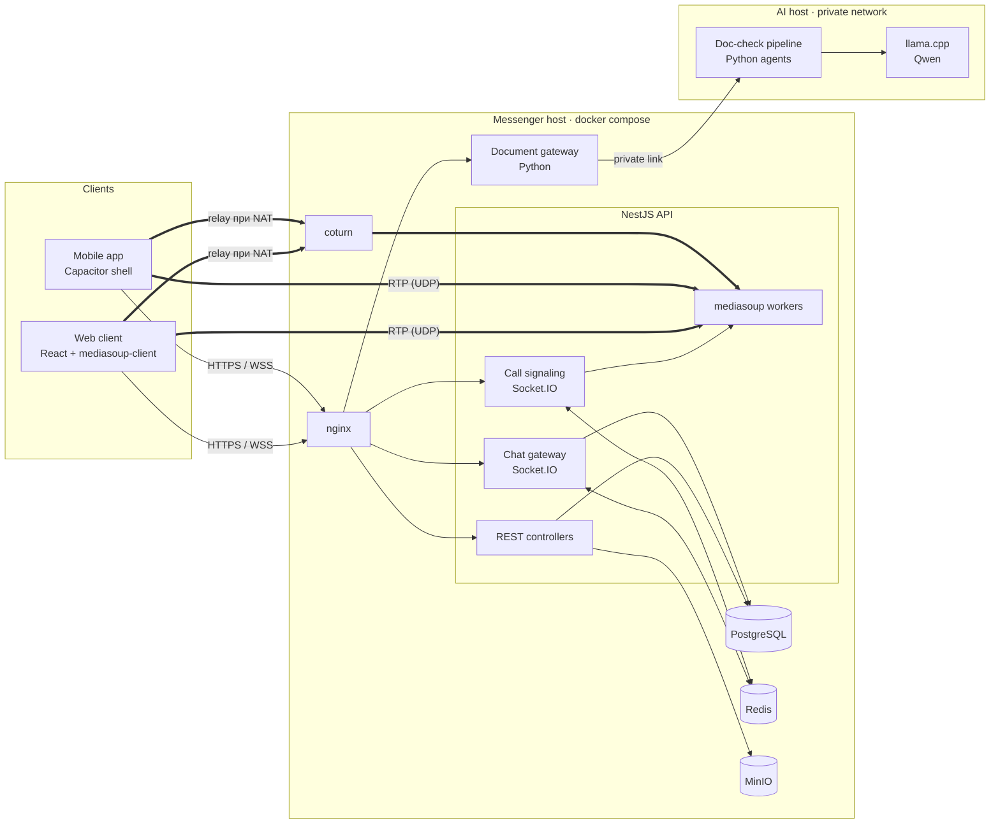
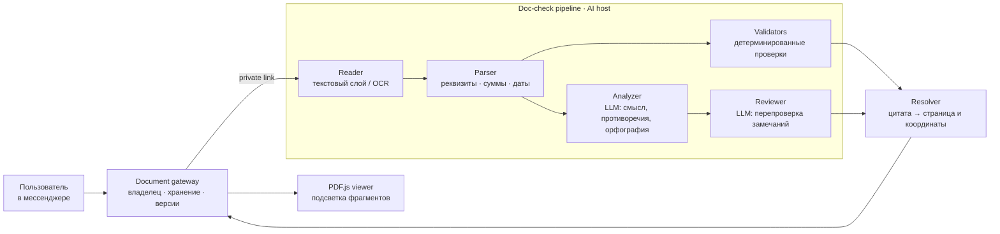

# RM Messenger — корпоративный мессенджер on-prem

Self-hosted мессенджер для компаний, которые держат переписку на своих серверах: чаты, файлы, аудио- и видеозвонки (1:1 и групповые, демонстрация экрана), push-уведомления, веб-клиент и мобильное приложение. Встроенная ИИ-проверка документов работает на локальной модели, без внешних API. Разворачивается на сервере заказчика через `docker compose`.

> Публичная витрина проекта. Исходный код закрыт; здесь описаны архитектура, процессы и мои зоны ответственности.

## Моя роль

Сооснователь и техлид. Отвечаю за:

- **архитектуру**: разбиение на сервисы, медиа-контур звонков (SFU + TURN), модель данных, интеграцию ИИ-сервисов;
- **бэкенд**: NestJS API, WebSocket-шлюзы чатов и звонков, сессии, push;
- **DevOps**: docker compose для on-prem установки, TLS, coturn, бэкапы, мониторинг по логам;
- **релизы**: процедуру выката с откатом, миграции схемы, приёмку на боевом контуре.

Фронтенд (React) ведёт отдельный разработчик команды. Обработчик документов для ИИ-проверки пишет отдельный разработчик; на мне контракт, интеграция и выкат.

## Стек

| Слой | Технологии |
|---|---|
| API | Node.js, **NestJS 10**, TypeScript |
| Данные | **PostgreSQL** + **Prisma 6** |
| Realtime | **Socket.IO 4** с connection state recovery |
| Координация | **Redis**: сессии звонков, pub/sub, привязка комнаты к SFU-узлу |
| Звонки | **mediasoup 3** (SFU), **coturn** (TURN/STUN) |
| Файлы | **MinIO** (S3-совместимое хранилище) |
| Edge | **nginx**: TLS, статика, проксирование API и WebSocket |
| Клиенты | React 19 + Vite, mediasoup-client; **Capacitor** (Android/iOS) |
| ИИ | Python, **llama.cpp** + Qwen, Tesseract OCR, PDF.js |

## Архитектура

**Как идёт звонок.** Клиент по WebSocket отправляет `joinRoom`. API проверяет членство в комнате и регистрирует сессию звонка в Redis: у пользователя одна активная сессия, старое устройство получает уведомление о замене. Комната закрепляется за SFU-узлом с heartbeat; если узел умер, комнату перехватывает живой. Остальным участникам идёт вызов через их персональные socket-комнаты, плюс push тем, у кого приложение закрыто. Дальше стандартный цикл mediasoup `createTransport → connectTransport → produce/consume`. Медиа идёт напрямую в SFU, а если UDP закрыт — через coturn.

**Мобильные обрывы.** Телефон в фоне рвёт WebSocket, но RTP-поток живёт. Поэтому разрыв сокета не завершает звонок сразу: даётся 20 секунд. Если вернулся тот же socket id (recovery window Socket.IO), звонок продолжается без пересборки транспорта. Если пришёл новый id, старый участник снимается сразу, чтобы в комнате не висел «призрак».

## ИИ-агенты: проверка документов

Пользователь отправляет договор, акт или счёт (PDF, скан, DOCX) на проверку прямо из мессенджера. Через несколько секунд он получает список замечаний: неверный ИНН, расхождение сумм, противоречащие даты, опечатки. Нажатие на замечание открывает PDF на нужной странице с подсвеченным фрагментом.

**Всё работает локально.** Модель Qwen обслуживает llama.cpp на отдельном GPU-сервере в приватной сети. OCR (Tesseract, rus+eng) тоже локальный. Ни документ, ни его фрагменты не уходят во внешние API — это требование заказчика и главный аргумент продукта. Функция включается и выключается переменной окружения; без неё мессенджер работает как раньше.

Конвейер устроен как цепочка агентов с узкими ролями, а не как один большой промпт:

- **Reader** достаёт текст из PDF, а для сканов запускает OCR.
- **Parser** выделяет структуру документа: реквизиты, суммы, даты.
- **Validators** отвечают за всё, что можно посчитать кодом: контрольные суммы ИНН, арифметику строк и итогов, форматы. Модель арифметику не считает: детерминированная проверка надёжнее и покрывается юнит-тестами.
- **Analyzer** (LLM) ищет то, что кодом не формализуется: противоречия, смысловые ошибки, опечатки.
- **Reviewer** (LLM) отбрасывает замечания, которые не подтверждаются текстом.

**Против галлюцинаций** заложено несколько правил:

- Модель возвращает только дословные цитаты и тип замечания, а координаты на странице вычисляет код.
- Если цитата встречается в документе не один раз, замечание остаётся текстовым, без подсветки. Для противоречия нужны обе стороны.
- При слабом OCR покрытие уменьшается, но координаты не угадываются.
- Фильтры отбрасывают «исправления», которые меняют цифры, касаются только регистра или пунктуации или не совпадают с источником. Эти правила появились после реальных ложных срабатываний модели и закреплены регрессионными тестами.
- Ответ модели ограничен JSON-схемой (grammar-constrained generation в llama.cpp).

**Интеграция.** Document gateway стоит рядом с мессенджером. Он проверяет, что результат видит только владелец документа, хранит результаты и связывает каждый из них с SHA256 оригинала, ID задания и версией формата. Поэтому старые результаты открываются после обновления, а подмена файла обнаруживается. Короткий документ обрабатывается примерно за 7–10 секунд.

**Как проверяем.** Есть 48 тестов на Python: реальные русские PDF, повороты страниц и CropBox, OCR, повторы и изоляция владельцев. Ещё 17 frontend-тестов проверяют отрисовку подсветки в PDF.js на разных экранах. Перед релизом идёт сквозной прогон: синтетические документы проходят через настоящий UI и настоящую модель. Ответы модели не подменяются, проверки опираются на HTTP, JSON и геометрию, а не только на скриншоты.

## Процесс деплоя

Продукт стоит у заказчика, и «поправить на лету» там нельзя. Поэтому выкат построен так, чтобы любой шаг можно было откатить.

1. **Неизменяемые теги образов.** Каждая сборка получает тег `ГГГГММДД-vNNN`. Собирать без тега запрещено: `compose build` перезаписал бы тег работающего образа и уничтожил точку отката.
2. **Бэкап с проверкой.** Перед каждым выкатом делается `pg_dump`, затем `gzip -t`, подсчёт строк и таблиц в дампе. Проверка появилась после случая, когда из-за неверного имени сервиса «успешный» бэкап весил 20 байт.
3. **Проверка артефакта.** До переключения проверяем, что в образе есть точка входа. У фронта проверяем, что файлы *читаются* пользователем nginx, а не просто существуют.
4. **Миграции отдельным шагом.** На продакшене миграции не запускаются при старте контейнера, чтобы ошибка миграции не превращалась в цикл перезапусков. Их выполняет одноразовый контейнер нового образа до переключения. Откат образа схему не откатывает, поэтому миграции, ломающие предыдущую версию, выкатываются в два релиза.
5. **Переключение и автооткат.** Делаем снимок `.env`, меняем тег образа и пересоздаём только нужный сервис. Затем health-check и сверка запущенного образа; при любом сбое после переключения скрипт сам возвращает прежний тег.
6. **Приёмка.** Изменение на боевом контуре проходит только после письменного «на выход»: состав, риск, план отката.
7. **Ночной разбор логов.** Раз в сутки read-only скрипт собирает:
   - перезапуски контейнеров и ошибки API;
   - 429, 5xx и 499 из nginx;
   - звонки, где трубку взяли, но медиа не встало (признак проблем с TURN);
   - пользователей без push и расход ресурсов.

   Жалобы «нестабильно» разбираются по этим цифрам, а не по ощущениям.
