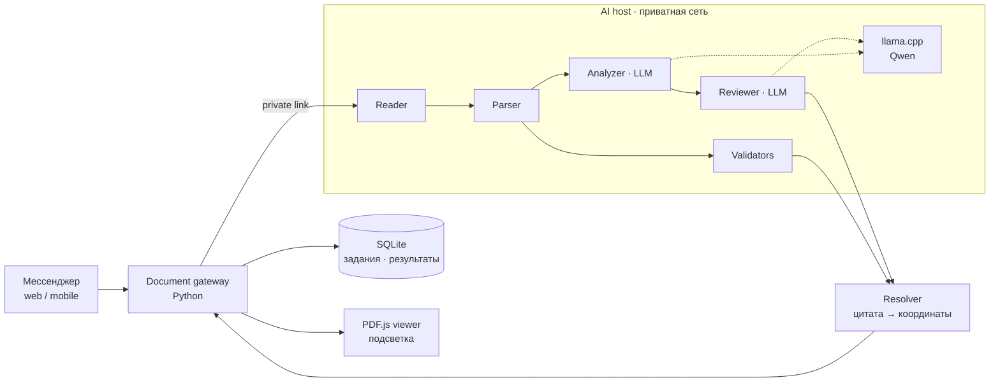

# ИИ-проверка документов

Пользователь отправляет договор, акт или счёт (PDF, скан, DOCX) на проверку прямо из мессенджера. Через несколько секунд он получает список замечаний: неверный ИНН, расхождение сумм, противоречащие даты, опечатки. Нажатие на замечание открывает PDF на нужной странице с подсвеченным фрагментом.

## Главное ограничение: всё локально

Продукт продаётся компаниям, которые не выпускают данные за пределы своего контура. Поэтому:

- модель (Qwen) работает через **llama.cpp** на отдельном GPU-сервере в приватной сети;
- OCR (**Tesseract**, rus+eng) тоже локальный;
- ни документ, ни его фрагменты не отправляются во внешние API;
- функция включается переменной окружения, без неё мессенджер работает как раньше;
- если ИИ-контур упал, мессенджер это не затрагивает.

## Архитектура

### Конвейер агентов

Проверка устроена как цепочка агентов с узкими ролями, а не как один большой промпт.

| Агент | Что делает | Модель? |
|---|---|---|
| **Reader** | Достаёт текст из PDF, для сканов запускает OCR | нет |
| **Parser** | Выделяет структуру: реквизиты, суммы, даты | нет |
| **Validators** | Контрольные суммы ИНН, арифметика строк и итогов, форматы | нет |
| **Analyzer** | Противоречия, смысловые ошибки, опечатки | LLM |
| **Reviewer** | Перепроверяет замечания Analyzer | LLM |
| **Resolver** | Находит цитату в документе и вычисляет страницу и координаты | нет |

**Модель не считает арифметику.** Суммы, НДС, контрольные числа и даты проверяются детерминированным кодом: так надёжнее, и это покрывается юнит-тестами. LLM нужна только там, где правило не формализуется.

## Как сдерживаются галлюцинации

- **Модель возвращает цитаты, а не координаты.** Ответ модели — дословный фрагмент и тип замечания. Где он на странице, вычисляет код по текстовому слою или данным OCR, с учётом CropBox и поворота страницы (0/90/180/270).
- **Неоднозначность не подсвечивается.** Если цитата встречается в документе не один раз, замечание остаётся текстовым. Для противоречия нужны обе стороны. Отсутствующий элемент («нет подписи») никогда не получает выдуманную область.
- **Слабый OCR сокращает покрытие, но ничего не угадывает.** При низкой уверенности распознавания подсветки нет.
- **Фильтры «исправлений».** Отбрасываются предложения, которые меняют цифры, касаются только регистра или пунктуации или не совпадают с источником дословно. Каждый фильтр появился после реального ложного срабатывания модели и закреплён регрессионным тестом.
- **Структурированный вывод.** Ответ модели ограничен JSON-схемой через grammar-constrained generation в llama.cpp. Замечания — структуры с кодами, а не свободный текст: их можно считать, фильтровать и покрывать тестами.

## Document gateway

Сервис рядом с мессенджером. Он:

- принимает документ и ставит задание; проверка асинхронная, соединение не держится;
- показывает результат только владельцу документа;
- связывает результат с SHA256 оригинала, ID задания и версией формата результата. Поэтому результаты старого формата открываются после обновления (просто без подсветки), а подмена файла обнаруживается;
- отдаёт результат во встроенный PDF.js-просмотрщик с переходами между отмеченными местами.

## Тестирование

- **48 тестов на Python**: реальные русские PDF, суммы, даты и ИНН, многострочные фрагменты, повторы и перекрытия, восемь сочетаний поворота и CropBox, реальный OCR, повреждённые привязки, изоляция владельцев.
- **17 frontend-тестов**: отрисовка подсветки в PDF.js при разных размерах экрана, ориентации и плотности пикселей; переходы между местами; старые результаты.
- **Сквозной прогон перед релизом.** Синтетические документы (текстовый PDF, скан, противоречащие даты, повторяющийся текст, отсутствующие реквизиты) загружаются через настоящий UI в настоящую модель. Ответы модели не подменяются, проверки опираются на HTTP, JSON, хеши и геометрию, а не только на скриншоты. Первый такой прогон нашёл две реальные проблемы, которые юнит-тесты не ловили: несовместимость JSON-схемы с грамматикой llama.cpp и ложные «исправления» года.

Короткий документ обрабатывается примерно за 7–10 секунд.

## Ограничения, о которых говорим прямо

- Проверена корректность привязки замечаний к тексту, а не полнота юридического анализа: модель может ошибиться по смыслу даже при точной цитате.
- Подсветка работает для PDF. DOCX, DOC и RTF проходят проверку, но подсветка на их превью требует привязки к конкретной версии конвертации и в первый объём не вошла.
- Большие документы под нагрузкой отдельно не аттестованы.

## Дальше

Две модели под разные задачи: лёгкая MoE-модель для потока коротких запросов и модель ~30B для документов. Инференс на vLLM вместо llama.cpp ради параллельных сессий; одна GPU на 32 ГБ вмещает обе модели.
