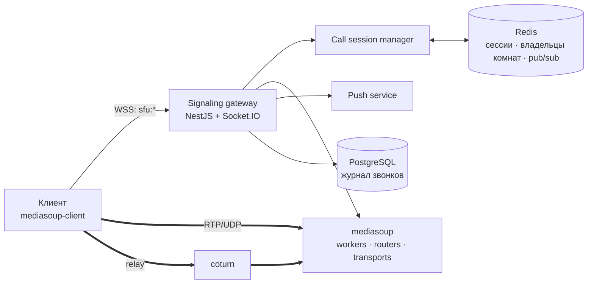
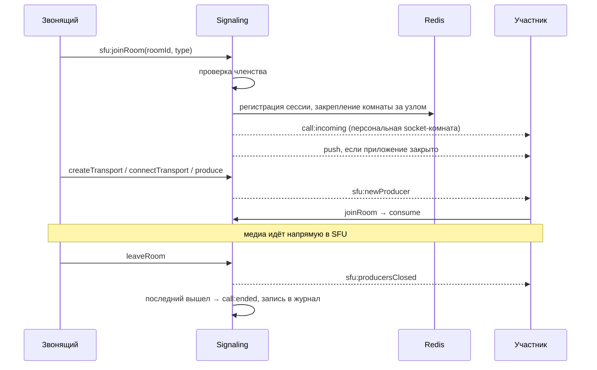

# Звонки: signaling, SFU и мобильные обрывы

Аудио- и видеозвонки 1:1 и групповые, с демонстрацией экрана. Медиа идёт через собственный SFU на mediasoup; signaling — через Socket.IO внутри того же NestJS API.

## Компоненты

- **Signaling gateway** принимает события `joinRoom`, `createTransport`, `connectTransport`, `produce`, `consume`, `closeProducer`, `leaveRoom`. Каждое событие проходит валидацию DTO и проверку членства в комнате. Ответ — единый ack-формат `{ok, data | error}`, так что клиент не разбирает исключения.
- **Call session manager** хранит активные сессии в Redis и координирует узлы.
- **mediasoup** держит транспорты, producers и consumers. Медиа не проходит через Node.js-процесс API.
- **coturn** нужен клиентам за NAT и корпоративными файрволами, где прямой UDP до SFU закрыт.

## Жизненный цикл звонка

## Решения, которые пришлось принять

**Одна активная сессия звонка на пользователя.** Сессия хранится в Redis с TTL 15 минут, TTL продлевается на каждом событии. Если пользователь входит в звонок с другого устройства, старое получает событие о замене через Redis pub/sub. Это работает, даже когда старый сокет живёт на другом инстансе API.

**Закрепление комнаты за SFU-узлом.** Все участники одной комнаты должны попасть в один mediasoup router. Владелец комнаты записывается в Redis через `SET NX`, каждый узел раз в 30 секунд обновляет heartbeat с TTL 90 секунд. Если узел-владелец перестал отвечать, комнату перехватывает живой узел и чистит устаревшее состояние. Пока владелец жив, чужой узел получает явную ошибку конфликта и не создаёт второй router.

**Вызов без задержки.** Сначала входящий вызов рассылался через поиск сокетов по Redis-адаптеру, и это занимало около 5 секунд, пока звонящий ждал. Теперь каждый клиент при подключении входит в персональную комнату `user:<id>`, и вызов отправляется в неё мгновенно. Push для закрытых приложений уходит параллельно и вход не блокирует.

**Отложенный teardown при обрыве сокета.** Телефон в фоне или при переключении с сотовой сети на Wi-Fi рвёт WebSocket, но транспорты mediasoup от сокета не зависят, и RTP-поток продолжает идти. Раньше звонок завершался вместе с сокетом. Теперь после разрыва даётся окно ожидания:
- тот же socket id вернулся (connection state recovery в Socket.IO) — звонок продолжается без пересборки;
- клиент вернулся с новым id — старый участник снимается сразу, чтобы в комнате не висел «призрак».

Окно сначала было 75 секунд, и остальные участники подолгу смотрели на плитку человека, которого уже нет. Сейчас оно 20 секунд: этого хватает на переключение приложения и смену сети.

**Явное закрытие producer на сервере.** `producer.close()` в mediasoup-client закрывает producer только локально. После остановки демонстрации экрана серверный producer продолжал жить, и зрители видели застывший последний кадр. Теперь клиент отдельно сообщает серверу о закрытии, а сервер рассылает `sfu:producersClosed` всем участникам.

**Источник видео в метаданных producer.** Камера это или экран, хранится вместе с producer. Тот, кто вошёл в звонок позже, получает список producers уже с этой пометкой, и клиент правильно решает, показывать ли аватар «камера выключена».

## Мобильное приложение

Браузер на телефоне упирается в ограничения платформы: звонки не приходят при закрытом приложении, нельзя переключить звук между разговорным динамиком и громкой связью. Поэтому мобильное приложение — нативная оболочка на Capacitor. Она загружает живую веб-версию, а нативные модули отвечают за доставку звонков и маршрутизацию звука. Обновления интерфейса не требуют выпуска новой версии в магазинах.
