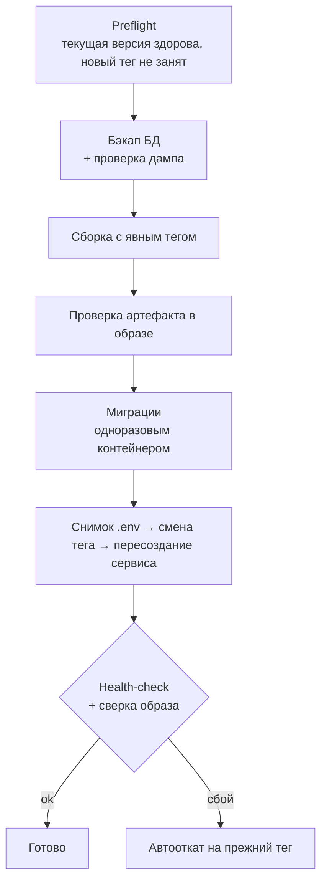

# Релизы и эксплуатация

Продукт стоит на сервере заказчика. Доступ туда есть, но «поправить на лету» нельзя: каждое изменение должно иметь понятный откат и предсказуемое время простоя. Отсюда процедура ниже.

## Выкат бэкенда

1. **Неизменяемые теги образов.** Каждая сборка получает тег `ГГГГММДД-vNNN`. Собирать без тега запрещено: `docker compose build` перезаписал бы тег работающего образа и уничтожил точку отката.
2. **Бэкап с проверкой.** Перед каждым выкатом делается `pg_dump`, затем `gzip -t`, подсчёт строк и таблиц. Проверка появилась после случая, когда из-за неверного имени сервиса «успешный» бэкап весил 20 байт: `pg_dump` не запустился, а `gzip` честно сжал пустоту.
3. **Проверка артефакта.** До переключения проверяем, что в образе есть точка входа. Сборка NestJS без явного конфига молча меняет структуру `dist/`, если в контекст попадёт лишний `.ts` в корне, и контейнер не стартует.
4. **Миграции отдельным шагом.** На продакшене миграции не запускаются при старте контейнера: иначе ошибка миграции превращается в цикл перезапусков. Миграции выполняет одноразовый контейнер нового образа до переключения. Откат образа схему не откатывает, поэтому миграции, ломающие предыдущую версию, выкатываются в два релиза.
5. **Переключение и автооткат.** Делаем снимок `.env`, меняем тег, пересоздаём только нужный сервис, остальные контейнеры не трогаем. Затем health-check и сверка ID запущенного образа. При любом сбое после переключения скрипт через `trap` сам возвращает прежний тег.

## Выкат фронтенда

У веб-клиента есть service worker, поэтому старая версия может жить в браузере пользователя после релиза. Что делаем:

- у каждого релиза свои неизменяемые URL ресурсов, свой маркер версии и свои имена кэшей service worker;
- перед переключением проверяем, что файлы в образе *читаются* пользователем nginx, а не просто существуют: однажды права файлов, приехавших с Windows-диска, привели к тому, что сайт открывался, но service worker, манифест и переводы отдавали 403 — приложение было мертво;
- после переключения проверяем, что живой сервер отдаёт новую версию, а ID остальных контейнеров не изменились;
- переход «старая версия → новая → перезагрузка → откат» для service worker проверяется до выката.

## Схема миграций

Часть ранней истории схемы катилась через `prisma db push`, поэтому каталог миграций не был источником правды: на чистой установке не хватало таблицы, а одна применённая на продакшене миграция отсутствовала в git. Мы восстановили её, добавили baseline-миграцию и добились, что `prisma migrate diff` против боевой базы показывает «No difference detected». Теперь перед любой работой со схемой это сравнение запускается первым.

## Приёмка

Изменение на боевом контуре проходит только после письменного «на выход»: что меняется, какой риск, как откатить. Тестовый сервер и боевой контур имеют разные процедуры, и они записаны отдельно, чтобы команда не перепутала одну с другой.

## Ночной разбор

Раз в сутки read-only скрипт собирает отчёт за период:

| Раздел | Зачем |
|---|---|
| Перезапуски контейнеров | Ноль перезапусков при жалобах означает, что проблема на стороне клиента |
| Ошибки API, сгруппированные по тексту | Частые ошибки видны сразу, ID в тексте схлопываются |
| 429, 5xx, 499 из nginx | 429 — прямая причина жалобы «не могу зайти», 499 — обрыв со стороны клиента |
| Звонки: взяли трубку / медиа встало | Трубку взяли, а медиа не встало — признак проблемы с TURN |
| Пользователи без push | Они не узнают о сообщениях и звонках при закрытом приложении |
| Активность: сообщения, авторы, живые чаты | Ответ на вопрос «оно вообще работает» |
| Ресурсы контейнеров и диск | Близкая к лимиту память API — кандидат на OOM |

В скрипте нет `2>/dev/null` на SQL-запросах. Однажды опечатка в имени колонки давала пустой раздел «Звонки», и отчёт три раза подряд показывал «звонков не было».

Жалобы «нестабильно» разбираются по этим цифрам. В одном таком разборе за сутки оказалось ноль перезапусков и ноль ошибок, а настоящей причиной было то, что большинство пользователей не включили push.

Известное ограничение: `docker logs` хранит историю только с момента создания контейнера, и после каждого выката глубина логов обнуляется. Внешний сбор логов — следующий шаг.
